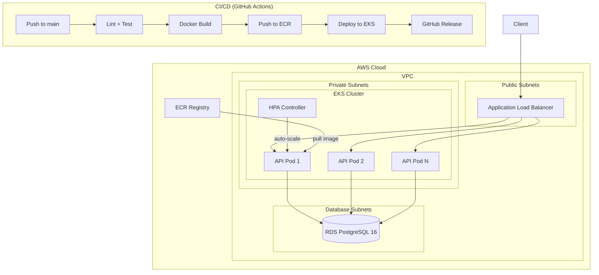
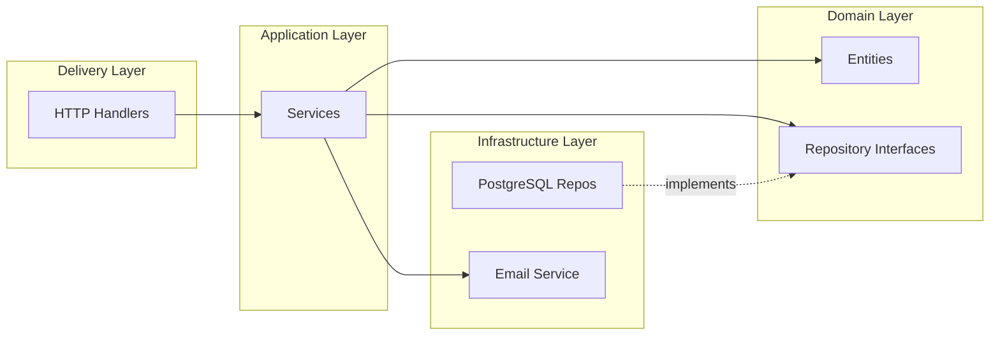
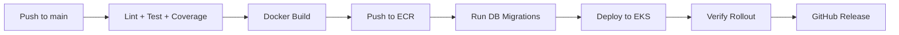

# 🔧 Auto Repair Shop API — Phase 2

API de gerenciamento de oficina mecânica com arquitetura limpa, containerização, orquestração Kubernetes e deploy automatizado na AWS.

## 📋 Índice

- [Arquitetura](#arquitetura)
- [Tech Stack](#tech-stack)
- [Funcionalidades](#funcionalidades)
- [Execução Local](#execução-local)
- [Testes](#testes)
- [Docker](#docker)
- [Kubernetes (EKS)](#kubernetes-eks)
- [Terraform (IaC)](#terraform-iac)
- [CI/CD](#cicd)
- [API Endpoints](#api-endpoints)
- [Documentação da API](#documentação-da-api)

---

## Arquitetura



### Arquitetura de Módulos (Clean Architecture)



```
internal/
├── identity/           # Autenticação (JWT)
├── inventory/          # Peças (CRUD + estoque)
├── notification/       # E-mail (mock/console)
├── service/            # Ordens de serviço
│   ├── domain/         # Entidades + interfaces
│   ├── application/    # Casos de uso
│   ├── delivery/http/  # Handlers REST
│   └── infrastructure/ # Repositórios PostgreSQL
└── sharedkernel/       # Tipos compartilhados
```

---

## Tech Stack

| Camada | Tecnologia |
|:---|:---|
| Linguagem | Go 1.23 |
| Router | Chi v5 |
| Banco de dados | PostgreSQL 16 |
| Autenticação | JWT (bcrypt) |
| Containers | Docker (multi-stage) |
| Orquestração | Kubernetes (AWS EKS) |
| IaC | Terraform (AWS VPC + EKS + RDS + ECR) |
| CI/CD | GitHub Actions |
| Docs API | Swagger + Postman |
| Qualidade | golangci-lint, SonarQube |

---

## Funcionalidades

### Ordens de Serviço (6 status)
`Received` → `In Diagnosis` → `Awaiting Approval` → `In Execution` → `Completed` → `Delivered`

### APIs Phase 2
- **Listagem ativa** (`GET /admin/orders`): Retorna ordens ativas ordenadas por prioridade de status (In Execution > Awaiting Approval > In Diagnosis > Received), excluindo Completed e Delivered
- **Aprovação/Rejeição de Orçamento** (`POST /orders/{id}/budget-response`): Endpoint público (webhook) para aprovação/rejeição externa de orçamentos
- **Tracking público** (`GET /orders/{id}/track`): Consulta pública do status da ordem

### CRUD Completo
- Clientes, Veículos, Peças (com estoque), Serviços
- Relatórios: receita e tempo médio de execução

---

## Execução Local

### Pré-requisitos
- Go 1.23+
- Docker e Docker Compose
- Make

### Quick Start

```bash
# 1. Clonar o repositório
git clone https://github.com/noggrj/autorepair.git
cd autorepair

# 2. Subir ambiente local (app + PostgreSQL + SonarQube)
make up

# 3. Executar migrations
make migrate-docker

# 4. Popular dados iniciais (seed)
make seed-docker

# 5. Acessar a API
curl http://localhost:8080/health
```

### Swagger UI
Acesse: [http://localhost:8080/swagger/index.html](http://localhost:8080/swagger/index.html)

### Autenticação
```bash
# Login (retorna JWT token)
curl -X POST http://localhost:8080/auth/login \
  -H "Content-Type: application/json" \
  -d '{"email":"admin@autorepair.com","password":"admin123"}'

# Usar o token nas requisições protegidas
curl http://localhost:8080/admin/orders \
  -H "Authorization: Bearer <SEU_TOKEN>"
```

---

## Testes

```bash
# Todos os testes unitários
make test-unit

# Testes de integração (requer banco rodando)
make up && make migrate-docker
make test-integration

# Coverage report
make test-cover

# Rodando Go test direto
go test ./... -v
```

---

## Docker

### Build Production
```bash
docker build --target production -t autorepair:latest .
```

### Docker Compose (Desenvolvimento)
```bash
# Subir todos os serviços
docker compose up -d --build

# Ver logs
docker compose logs -f app

# Parar
docker compose down
```

---

## Kubernetes (EKS)

### Manifestos (`/k8s`)

| Manifesto | Descrição |
|:---|:---|
| `namespace.yaml` | Namespace `autorepair` |
| `configmap.yaml` | Config não-sensível (PORT, DB_HOST, etc.) |
| `secret.yaml` | Credenciais (DB_PASSWORD, JWT_SECRET) |
| `deployment.yaml` | API: 2 replicas, health probes, resource limits |
| `service.yaml` | ClusterIP na porta 8080 |
| `hpa.yaml` | Auto-scaling: 2-10 pods (CPU 70%, Memory 80%) |
| `db-deployment.yaml` | PostgreSQL + PVC (dev local) |
| `db-service.yaml` | Serviço do PostgreSQL |

### Deploy Manual
```bash
# Configurar kubectl para o cluster EKS
aws eks update-kubeconfig --region us-east-1 --name autorepair-cluster

# Aplicar manifestos
kubectl apply -f k8s/

# Verificar status
kubectl get pods -n autorepair
kubectl get svc -n autorepair
```

---

## Terraform (IaC)

### Recursos provisionados (`/infra`)

| Recurso | Descrição |
|:---|:---|
| VPC | 3 AZs, subnets públicas/privadas/database, NAT Gateway |
| EKS | Cluster Kubernetes gerenciado com node group auto-scaling |
| ECR | Registro de containers com lifecycle policy |
| RDS | PostgreSQL 16, encrypted, backup automático |

### Provisionamento
```bash
cd infra

# Copiar e preencher variáveis
cp terraform.tfvars.example terraform.tfvars

# Inicializar, planejar e aplicar
terraform init
terraform plan
terraform apply

# Configurar kubectl
aws eks update-kubeconfig --region us-east-1 --name autorepair-cluster
```

> ⚠️ **Nunca commite `terraform.tfvars`** — contém credenciais sensíveis.

Veja detalhes completos em [`infra/README.md`](infra/README.md).

---

## CI/CD

Pipeline automatizado em `.github/workflows/ci.yml`:



| Job | Trigger | Descrição |
|:---|:---|:---|
| `build-and-test` | Push/PR | Lint, testes, coverage |
| `docker-build-push` | Push main | Build + push para ECR |
| `deploy` | Push main | Migrate + deploy no EKS |
| `release` | Push main | Tag + GitHub Release |

### Secrets Necessários (GitHub)
- `AWS_ACCESS_KEY_ID` / `AWS_SECRET_ACCESS_KEY`
- `DB_URL` (URL de conexão completa do RDS)

---

## API Endpoints

### Públicos
| Método | Endpoint | Descrição |
|:---|:---|:---|
| POST | `/auth/login` | Autenticação JWT |
| POST | `/auth/register` | Registro de usuário |
| GET | `/orders/{id}/track` | Tracking público da OS |
| POST | `/orders/{id}/budget-response` | Aprovação/rejeição de orçamento |
| GET | `/swagger/*` | Documentação Swagger |
| GET | `/health` | Health check |

### Protegidos (requer JWT)
| Método | Endpoint | Descrição |
|:---|:---|:---|
| POST | `/admin/orders` | Criar ordem de serviço |
| GET | `/admin/orders` | Listar ordens ativas (prioridade) |
| GET | `/admin/orders/{id}` | Detalhes da ordem |
| PATCH | `/admin/orders/{id}/approve` | Aprovar ordem |
| POST | `/admin/orders/{id}/diagnosis:start` | Iniciar diagnóstico |
| POST | `/admin/orders/{id}/budget:send` | Enviar orçamento |
| POST | `/admin/orders/{id}/finish` | Finalizar ordem |
| POST | `/admin/orders/{id}/deliver` | Entregar ordem |
| PATCH | `/admin/orders/{id}/status` | Atualizar status |
| GET | `/admin/reports/revenue` | Relatório de receita |
| GET | `/admin/reports/avg-execution-time` | Tempo médio de execução |
| POST/GET/PUT/DELETE | `/admin/clients` | CRUD de clientes |
| POST/GET/PUT/DELETE | `/admin/vehicles` | CRUD de veículos |
| POST/GET | `/admin/parts` | CRUD de peças |
| POST/GET/PUT/DELETE | `/admin/services` | CRUD de serviços |

---

## Documentação da API

- **Swagger UI**: [http://localhost:8080/swagger/index.html](http://localhost:8080/swagger/index.html)
- **Postman Collection**: [`docs/postman_collection.json`](docs/postman_collection.json)

---

## Licença

MIT